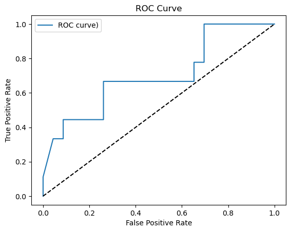
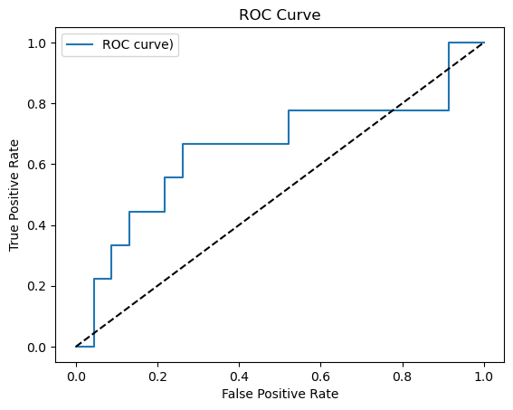
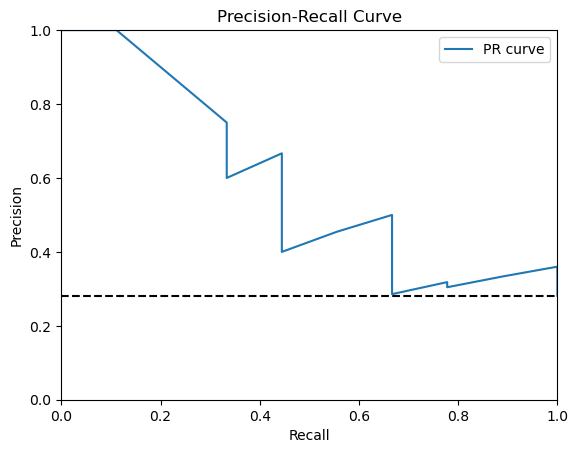
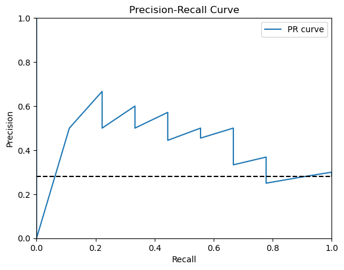

## Comparision
||ROC AUC|Average Precision
|--|--|--|
|With Rotations (Class Samples={0:3,1:8}|0.575|0.408|
|Without Rotations (Class Samples={0:1,1:0})|0.613|0.489

## ROC Curve
|With Rotations|Without Rotations|
|--|--|
|||

## Precision-Recall Curve
|With Rotations|Without Rotations|
|--|--|
|||